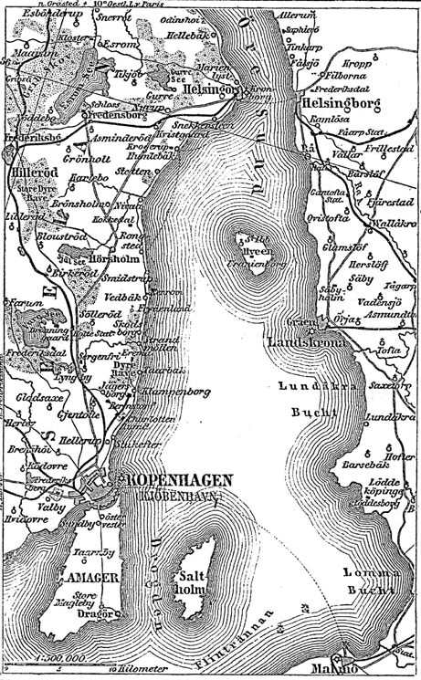
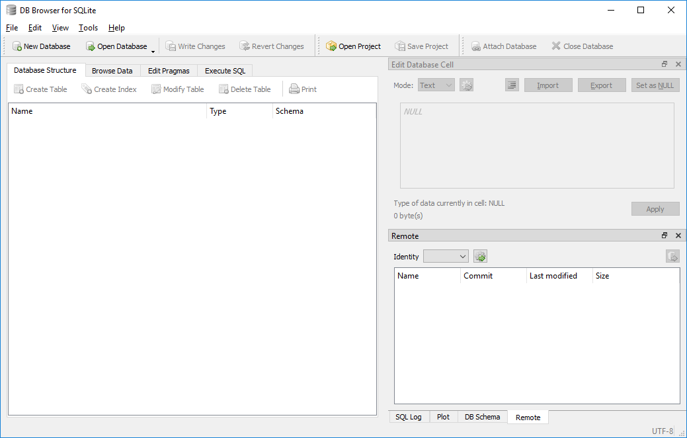
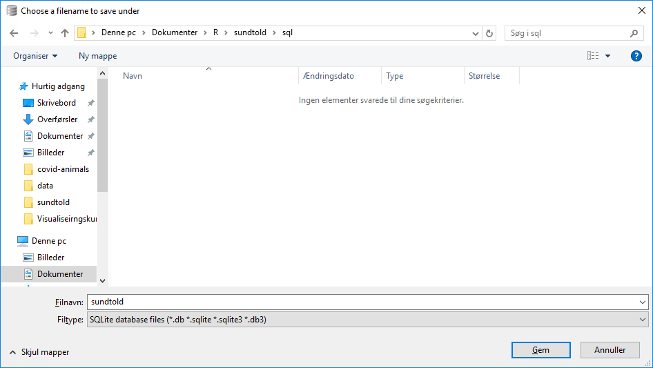
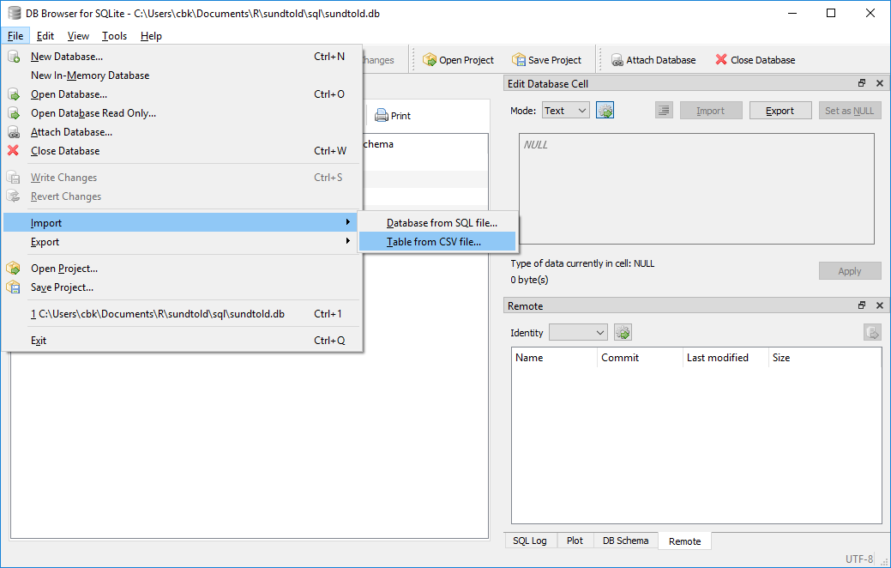
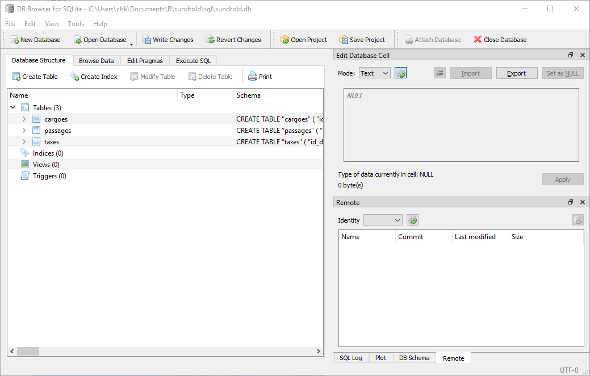

```{r, out.width = "100px", echo=F}

```


Der blev efterlyst et konkret eksempel på ting som de her teknikker kan bruges til.

En historiestuderende har kastet sin kærlighed på de digitaliserede registreringer
af sundtolden. Man har på siden http://www.soundtoll.nl/, mod simpel registrering, adgang til at søge i alle skibe der passerede Helsingør i perioden fra 1561 til 1857. 

Der er oplysninger om passagerne, oplysninger om hvilken last skibet havde, og om hvilke skatter der blev betalt.

Til dette formål går vi ikke meget dybt i indholdet.

Jeg har pakket 20 års data ned i filen data.zip.

Den ligger i et github repository, og kan hentes således:
```{r eval=F}
$ curl -LO https://github.com/chrbknudsen/sundtold/raw/master/data/data.zip
```


Man kan selvfølgelig også blot klone hele repositoriet.

Filen kan pakkes ud, og så har man en række csv-filer for årene 1800-1819. 

Årstallet indgår i filnavnet, og de filer der starter med "cargoes" indeholder oplysninger om lasten. "passages" indeholder oplysninger om den konkrete passage af skibet, dets navn, kaptajnen, datoen osv. Og "taxes"-filerne har oplysninger om hvilken skat der blev betalt.

Når nu man vil vide hvor mange skibe der passerede hvert år, kan man selvfølgelig bare tælle antallet af rækker i hver fil med passager.

Men når man vil sammenligne bredere, og se om antallet af skibe, hvor kaptajnen kommer fra Amsterdam, der passerer i forårsmånederne, varierer over årene, så bliver det lidt mere tricky.

Et oplagt første skridt er at samle alle csv-filerne i et enkelt regneark. Eller nok snarere at samle alle "passages" filerne i et ark.

Der er to måder.

Man kan gøre det manuelt. Det tager tid. 

Eller man kan få computeren til at gøre det. 

Da jeg talte med den studerende brugte jeg R til at få computeren til at gøre det. Man kan også gøre det på kommandolinien.

Prøv at gøre det. Vi skal have et shell-script, der tager alle eksempelvis cargoes filerne, og samler dem i en fil. Alle filerne har den samme første linie, der indeholder kolonne overskrifterne. Prøv at få den med en og kun en gang.


```{r eval=F}
#!/bin/bash
outfilename="cargoes_samlet.csv"
i=0
for filename in ./raw_data/cargoes*.csv; do

  if [ "$filename" != "$outfilename" ];
  then
    if [[ $i != 1 ]];
    then
        head -1 "$filename" > "$outfilename"
        i=(1)  
    fi
    tail -n +2 "$filename" >> "$outfilename"
    
  fi
done

```

Vupti. Vi definerer et filnavn som vi vil gemme vores samlede cargoes i. Så sætter vi i=0. Og for hver fil der hedder noget med cargoes i starten og csv til slut, gør vi følgende. Hvis filnavnet er det samme som det filnavn vi vil gemme resultatet i, så gør vi ikke noget. Den fil skal jo indeholde resultatet, og ikke selv medtages. Så ser vi om i er forskellig fra 1. det er den for den første fil.
Når den er det, skal vi have den første række i filen gemt i vores endelige resultat. Når vi på den måde har fået overskriften med, sætter vi i til at være lig 1.
Dernæst tilføjer vi indholdet af filen til vores udfil. Bortset fra den første række, der indeholder kolonneoverskrifterne. Dem ville vi ikke have med.
Den næste fil - den hedder også noget andet end ud-filen. Men nu er i=1. Så i stedet for at tilføje kolonneoverskrifterne en gang til, tilføjer vi bare, appender med >>, filen til udfilen. Bortset fra den første linie.

Man burde måske have gjort det mere generelt. Men det er samme mølle for passager og taxes.

Der er behov for noget oprydning. Ret meget.

```{r, echo=F, message=F}
data <- read.csv2("passages_samlet.csv", encoding = "UTF-8", stringsAsFactors = F)
library(dplyr)
library(stringr)
data %>% 
  select(schipper_plaatsnaam) %>% 
  arrange(schipper_plaatsnaam) %>% 
  unique( ) %>% 
  filter(str_starts(schipper_plaatsnaam, "K")) %>% 
  filter(str_ends(schipper_plaatsnaam, "n")) %>% 
  filter(str_starts(schipper_plaatsnaam, "Kin", negate = T )) %>% 
  filter(str_starts(schipper_plaatsnaam, "Kn", negate = T)) %>% 
  filter(str_starts(schipper_plaatsnaam, "Ka", negate = T)) %>% 
  filter(str_starts(schipper_plaatsnaam, "Ku", negate = T)) %>% 
  knitr::kable()
```
Hvordan skruer man eksempelvis et regulært udtryk sammen, der fanger København. Men ikke andre af de her navne?

Hop gerne ind på regex101.com og test.

Det kunne være

```{r eval=F}
K[iøj][boø][be].*\s
```

Bortset fra at jeg godt vil tale med en historiker eller sprogforsker for at høre om Kowelshaun kunne være København.

Der er under alle omstændigheder rigeligt at tage sig til i OpenRefine. Og det her er blot København. Der er 2849 unikke tekststrenge i der angiver skipperens hjemsted. 

Og der er 50 kolonner. Alene i denne tabel.

Hvis nu vi vil have styr på hvilke varer der passerede Helsingør den 20. juni 1805, har vi en udfordring. 

Passagerne indeholder oplysninger om datoen. 

```{r}
read.csv2("passages_samlet.csv", encoding = "UTF-8", stringsAsFactors = F) %>% 
  select(1:6) %>% 
  head()
```

%>% er en pipe-operator, som vi har set den i unix-kommandoliniedelen. Den findes også i R.

Vores data ligger i en tabel i filen "passages_samlet.csv". Med funktionen read.csv2 indlæser vi den. UTF-8 fortæller hvordan filen er kodet, og stringsAsFactors beder R om at lade være med at gøre bestemte ting, der kan være lidt irriterende. Outputtet af den funktion sender vi videre til den næste funktion med pipe-operatoren %>%. Det minder meget om det vi gjorde på kommandolinien, hvor vi skriver | for at sende output af en funktion videre til den næste.

Data optræder i kolonner og rækker. Vi sender data videre med pipen til funktionen select. Den udvælger kolonnerne 1 til 6. Dernæst bruger vi pipen igen, til at sende data videre til funktionen head. Den minder også om noget vi har set før.

Men kigger vi på cargoes, er der intet om datoen!

```{r}
read.csv2("raw_data/cargoes_Year_=_1800.csv", encoding = "UTF-8", stringsAsFactors = F) %>% 
  head() %>% 
  select(1:6)
```


Tricket er at kolonnen "id_doorvaart" kæder oplysningerne sammen!

Så hvis vi kan finde de rækker i "passage"-arkene, der matcher en bestemt dato, så kan vi tage listen over de rækkers "id_doorvaart", og slå dem op i cargoes-arkene. 
Og så ved vi hvilke varer der passerede en bestemt dato.

Det kan gøres på mange måder. Nu skal vi jo prøve at arbejde med SQL også.

Så lad os importere filerne i den der db sqlite ting.


Vi starter med at oprette en ny database



Værktøjet vil straks have os til at redigere en tabel.
Det er der ingen grund til.

Vælg i stedet file - import - table from csv file, og importer cargoes_samlet, passages_samlet og taxes_samlet.



Eller hvad du nu kaldte de samlede filer da du samlede dem tidligere på kommandolinien.

Det skulle nu gerne se således ud:



Man kan mange fancy ting.

Dem kigger vi på i en separat gennemgang at sql.

Men det helt praktiske - hvordan bruger man så sql i denne sammenhæng.

```{r eval=F}
SELECT soort FROM passages 
JOIN cargoes ON passages.id_doorvaart = cargoes.id_doorvaart
WHERE jaar="1810" AND maand=6 AND dag=20 
```

Det var en lidt frustrerende oplevelse.

Q: In SQL, is it possible to insert a JOIN clause after a WHERE clause?

A: No, it's not possible. The order of operation is always JOIN first and WHERE after.

Man kan heller ikke smide en select ind efterfølgende.

Hvad gør vi?
Vi fortæller hvad vi udvælger, hvad er det vi vil have vist? Det er kolonnen "soort". Den optræder i tabellen passages. Som vi joiner, hægter sammen med, tabellen "cargoes", således at de rækker hvor id_doorvart fra passages er lig med id_doorvart fra cargoes er ens. Vi vil i øvrigt have de rækker, hvor det gælder at året er 1810, måneden 6 og dagen 20.

I R ville man gøre det anderledes. Og det ville jeg nok også gøre her. Nu er vi ikke nået til R endnu. 
Men det kan være interessant at trække det over i en database i stedet. Og hvorfor nu det?

Der var nok flere passager i de første 20 år af 1800-tallet, end der var i det 17. århundrede. Men lad os nu bare lade som om de er repræsentative.

CSV-filerne for de her 20 år fylder i sig selv 54,1 mb. Det var for 20 år, der er 292 år i alt. 
Et primitivt estimat vil være at csv-filerne for alle årene i alt vil fylde 1,2 gb.
Databasen fylder aktuelt 51,1 mb. Den vil komme op på 789 mb.

Det er så store størrelser, at det kan være vanskeligt for R at håndtere. Mens databasen først giver op når den kommer op i flere terabyte.

Nå. Hvordan gør man det i R?

```{r, message=F, warning=F}
library(RSQLite)
library(dbplyr)
library(dplyr)
con <- DBI::dbConnect(RSQLite::SQLite(), "sql/sundtold.db")
```

Vi skal bruge nogen biblioteker. For R kan ikke i sig selv. Og så skal vi have etableret en forbindelse til databasen vi lavede tidligere.

Konceptet med %>% -pipen og select kommandoen vi så tidligere, kommer fra den pakke i R der hedder dplyr. Den er supereffektiv. Men kan ikke arbejde med databaser.
Det kan pakken dbplyr. 

Vi skaber forbindelse til de enkelte tabeller i databasen:
```{r}
sund_tax <- tbl(con, "taxes")
sund_pas <- tbl(con, "passages")
sund_car <- tbl(con, "cargoes")
```

Og så kan vi hægte ting sammen i R!

```{r}
sund_pas %>% 
  left_join(sund_car, by="id_doorvaart") %>% 
  filter(jaar  ==1810,
         maand == 6,
         dag   == 20
         ) %>% 
  select(soort)
```
sund_pas %>% left_join(sund_car, by="id_doorvaart") 

svarer til: 
JOIN cargoes ON passages.id_doorvaart = cargoes.id_doorvaart
Altså der hvor vi hægter de to tabeller sammen.

Det sender vi videre til filterfunktionen:

filter(jaar  ==1810,
       maand == 6,
       dag   == 20
       )

Det svarer til:
WHERE jaar="1810" AND maand=6 AND dag=20 

Og til sidst udvælger vi hvad vi vil se med:
select(soort)
  
Som svarer til:
SELECT soort FROM passages 


